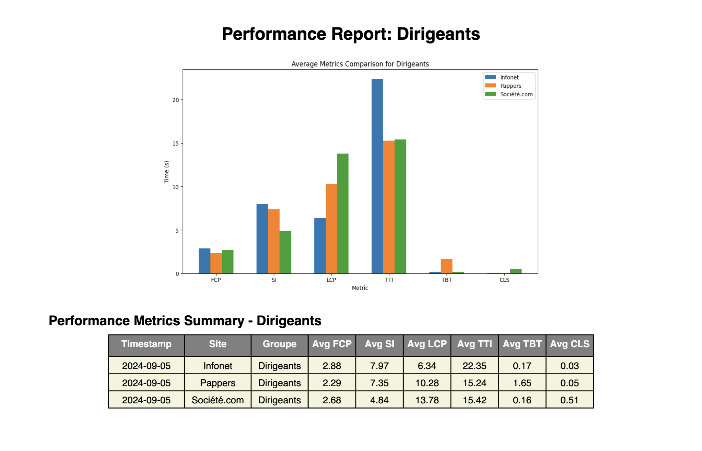

# Performance Benchmarking Script

## Overview

This script is designed to perform a synthetic benchmarking of web page performance metrics using Lighthouse.



 It collects performance data for different types of pages from various sites, aggregates the results, generates comparative graphs, and publishes the data to Google Sheets. This process allows the data to be stored historically and later visualized in tools like Looker (Data Studio). The goal is to benchmark web page performance across different typologies and represent this data effectively for analysis.

## How the Script Works

### 1. **Setup and Dependencies**

The script uses several libraries including `requests`, `subprocess`, `json`, `matplotlib`, and `reportlab`. It also uses `gspread` for Google Sheets integration and `concurrent.futures` to handle parallel execution of tasks.

- **Google Cloud Authentication**: The script requires a Google service account JSON file (`service_account.json`) to authenticate and access Google Sheets.
- **Node.js and Lighthouse**: The script relies on Node.js to run Lighthouse tests using a custom script (`lighthouse_test.mjs`). Make sure Node.js and Lighthouse are properly installed on your system.

### 2. **URLs Configuration**

The URLs are organized by site and page type in a nested dictionary format. For each site, URLs are categorized under "Dirigeants" (Directors) and "Entreprises" (Businesses). These URLs are the targets for the Lighthouse performance tests.

### 3. **Running Lighthouse Tests**

The function `run_lighthouse_test(url)` executes Lighthouse using Node.js via a subprocess. It captures performance metrics including:

- First Contentful Paint (FCP)
- Speed Index (SI)
- Largest Contentful Paint (LCP)
- Time to Interactive (TTI)
- Total Blocking Time (TBT)
- Cumulative Layout Shift (CLS)

### 4. **Processing URLs and Extracting Metrics**

The `process_urls(urls)` function handles the execution of multiple Lighthouse tests concurrently. It uses `ThreadPoolExecutor` to run tests in parallel, significantly speeding up the data collection process. Each test's results are parsed, and key metrics are extracted and stored in a list for further processing.

### 5. **Generating Comparative Graphs**

The function `generate_comparison_graph(data, page_type)` generates bar charts comparing the performance metrics of the different sites for each page type. The charts visually represent the average values of each metric, providing a quick overview of performance differences.

### 6. **Publishing Results to Google Sheets**

Results are published to a Google Sheet using the `publish_to_google_sheets(results)` function. This allows for historical data storage and further analysis in visualization tools like Looker (Data Studio). The data is appended to a sheet, maintaining a running log of performance metrics over time.

### 7. **Generating a PDF Report**

The `generate_pdf_report(results, output_file, sheet_data)` function creates a PDF report that includes:

- Comparative graphs of the performance metrics for each page type.
- A detailed table summarizing the average metrics for each site and page type.
- A dedicated section explaining the methodology and definitions of each metric.

### 8. **Detailed Methodology Section**

The report includes a "Methodology" page that describes the testing approach using Lighthouse and explains each metric in detail, helping stakeholders understand the context and significance of the results.

### 9. **Main Execution Flow**

The `main()` function orchestrates the overall process:

1. It iterates over each site and page type, collecting performance data.
2. Publishes the data to Google Sheets for historical record-keeping.
3. Generates a PDF report summarizing the results in both graphical and tabular formats.

## How to Use the Script

1. **Prerequisites**:
   - Ensure you have Python, Node.js, and Lighthouse installed.
   - Install required Python packages: `requests`, `gspread`, `reportlab`, `matplotlib`, etc.
   - Place your Google service account JSON file in the script directory and update `credentials_path`.

2. **Run the Script**:
   ```bash
   python script_name.py
   ```

3. **Output**:
   - **Google Sheets**: Performance data is appended to a specified Google Sheet.
   - **PDF Report**: A detailed report (`performance_report_comparison.pdf`) is generated, summarizing the results.

## Future Integration

The historical data stored in Google Sheets can be visualized in Looker (Data Studio) for deeper analysis and trend identification, enabling ongoing monitoring and optimization of web performance.

## License

This script is released under the MIT License.

## Contact

For any questions or issues, please contact the development team.

